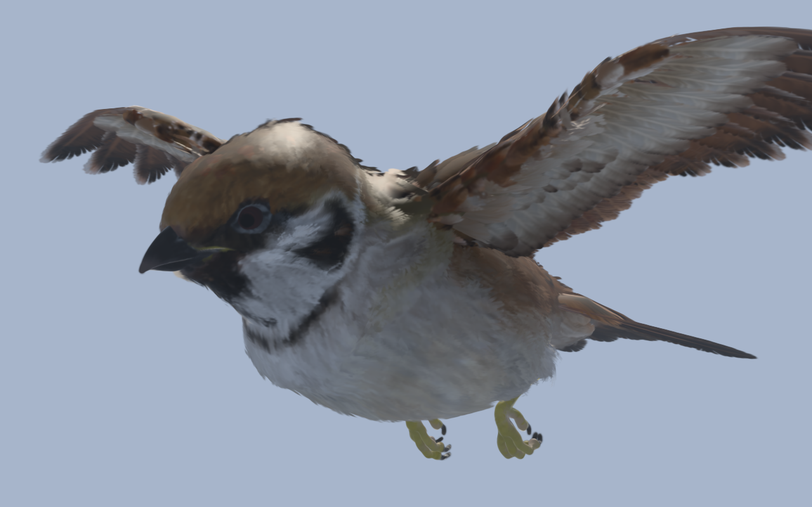
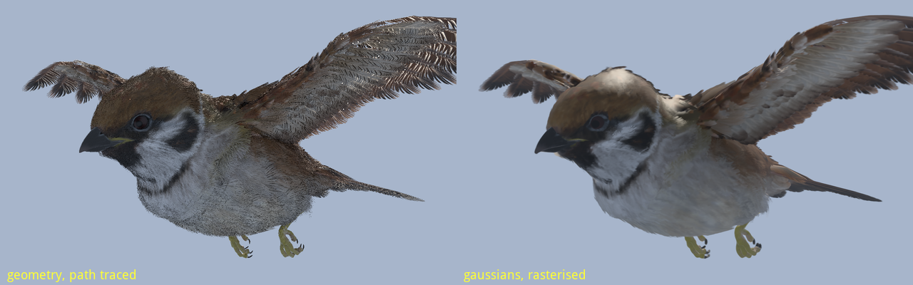
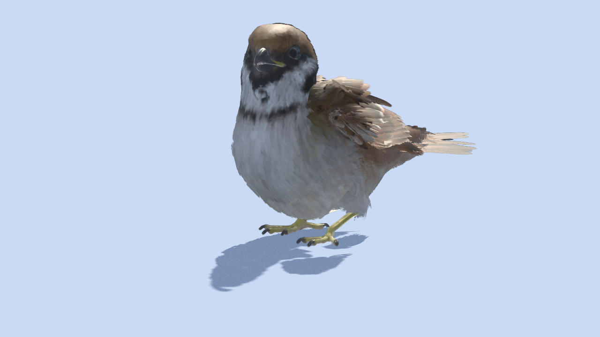

# Athenea

A Slang renderer for USD stages in which **Gaussian splats are a primitive
beside triangles**, and the engine openFXplayer is to stand on. macOS (Metal)
and Linux (CUDA/OptiX, Vulkan) first; Windows later.

Everything numeric runs on the GPU, reference renders and test oracles
included. The CPU reads files, parses headers and decompresses (SPZ, SOG's
WebP); decoding, sorting, levels of detail and image comparison are compute
kernels.



*5 887 323 gaussians carried by a 609-joint skeleton, rasterised. The cloud
came out of the mesh below with `athenea mesh2splat --skinned`; the light on it is
this frame's, not baked.*

## What it does

- **USD through Hydra 2.0.** `hdAthenea` is a render delegate for whole stages:
  meshes with their subdivision, materials, UsdLux lights, cameras, instancers,
  volumes, render settings and AOVs — and `ParticleField3DGaussianSplat` and
  `Points` beside them. Codeless schemas: `AtheneaSplatEditAPI`,
  `AtheneaSplatLightingAPI`, `AtheneaSplatSkinningAPI`, `AtheneaPointStyleAPI`,
  `AtheneaStreamedAssetAPI`.
- **Two ways to draw a frame**, over one visibility buffer that every route
  fills alike:
  - **raster** — a tile rasteriser for splats (global radix sort on the GPU,
    no per-tile limit, Mip-Splatting filters, SH in fp16), rasterised mesh
    visibility, and shading that traces only its shadow rays;
  - **rt** — a path tracer with next event estimation and MIS, over hardware
    acceleration structures or a Karras LBVH built and traversed in compute
    where there is no RT hardware.
- **Splats as geometry, not as a viewer.** Meshes, points and clouds are
  composited by view z in both routes; a cloud is relit by the scene's lights
  or shows the radiance it was baked with.
- **`athenea mesh2splat`**: a textured mesh becomes a cloud (based on
  mesh2splat, below), and a **skinned** mesh becomes a cloud bound to its
  Skeleton by `SkelBindingAPI`, as a mesh is, and deformed on the device
  from the Skeleton's animation — with the joints' transforms cached beside
  it, 3 MB of rig instead of a pose a frame.
- **`athenea visibility`**: what a skinned cloud casts on the space around it,
  baked once per part into octahedral fields and read every frame with no ray.
- **Materials**: MaterialX graphs compiled into Slang modules, named by a hash
  of their source so materials that differ only in values share one.
- **Lights**: UsdLux on the device — a light is sampled where it stands, and
  `lightPdf` is what a chi-square checks and what MIS weighs by.
- **Levels of detail and streaming**: octree levels built on the GPU by moment
  matching, a per-frame cut on the GPU, and `.athc` files streamed chunk by
  chunk into a fixed budget, most-wanted chunks first.
- **A lens and a shutter, without sampling either**: a splat is drawn
  convolved with the disk it is out of focus by and with the path it takes
  under the shutter -- one addition to its screen covariance each, so depth of
  field and motion blur cost one pass, not one pass a sample.
- **Cloud shadows with no ray**: what a cloud stops is accumulated from each
  light into a transmittance map (with the Fourier terms of it where a cloud
  has to shadow itself), so a floor under a bird is dark, gaussians shadow
  each other, and it works on a device that cannot trace at all. The shadow
  is the light's to shape: UsdLux `ShadowAPI` (`shadow:color`,
  `shadow:distance`, `shadow:falloff`) is read where it lands.
- **Colour out**: ACES 2.0 and OpenColorIO view transforms compiled into a
  kernel; Open Image Denoise on the engine's own queue.
- **The manuals**: [`docs/operations.md`](docs/operations.md) is how the
  engine is run — every subcommand's options with their defaults, the
  `athenea:*` render settings, the eight schemas, the viewer, the MCP server,
  troubleshooting. [`docs/development.md`](docs/development.md) is how it is
  made and changed, and carries the gaussian bake end to end. Both are also
  in Spanish, as `operations.es.md` and `development.es.md`.
- **`athenea view`**: a window on a stage — free camera, stage cameras, outputs,
  picking, a shutter, a combo for every variant set the stage carries — with
  Dear ImGui on the engine's device. Its technical outputs include the
  Cryptomatte: previewed with an id a colour, each layer raw, and one prim's
  matte pulled alone (`--isolate`, or the button on a pick). A pick names a
  gaussian through that matte, which is the only name a cloud's pixel has.
- **Variant sets**: USD's own "pick one of these", offered as it is found. An
  asset that packages seventy-one animations as variants is seventy-one
  animations in a dropdown, and the timeline follows the one selected — the
  engine has no idea any of them is a bird.
- **An MCP server** (`athenea-mcp`): open a stage, look at what is in it, render
  it, read back what a pixel saw, pick a variant.
- **Time**: frames at their SMPTE ST 2059-1 instants, on this machine's clock
  or a PTP master's (genlock); EXRs carry timecode and TAI.
- **aofx**: openFXplayer's plugin SDK and host at **ABI 25**. Bundles built by
  openFXplayer load unchanged.
- **GPU ground truth**: a brute-force per-pixel reference for the rasteriser
  and one for the ray tracer, and Storm as the oracle for geometry. Tests
  compare on the device and read back only p99 and max.
- **Loaders**: PLY, `.splat`, SPZ and SOG, decoded on the device.

## The conversion, seen



The same bird, same camera, same two lights: on the left the geometry it was
modelled as, path traced; on the right the gaussians it was converted into,
rasterised. The feather cards read their colour off one UV atlas and their
shape and normal off another, which the conversion follows; a barb whose
texel is 30 % opaque becomes a gaussian that is 30 % opaque, so a soft edge
stays soft.



`scripts/readme-images.sh` makes these three again from the assets.

## Building

Needs CMake ≥ 3.24, Ninja and a C++20 compiler, plus:

- **Slang 2026.14.1** in `~/tools/slang`: one Slang for gpe's blobs and for
  slang-rhi.
- **OpenUSD 26.08 with MaterialX 1.39.5 and OpenVDB** in
  `~/tools/usd-26.08-mx`: `scripts/build-usd.sh` builds it once per machine.
- **Open Image Denoise 2.5.1**, GPU devices only, in `~/tools/oidn-2.5.1`:
  `scripts/build-oidn.sh`. Without it the engine has no denoiser.
- **OpenColorIO 2.5.2** in `~/tools/ocio-2.5.2`: `scripts/build-ocio.sh`.
- **libwebp** (Homebrew `webp`) for SOG; without it, `.sog` is refused.
- **The submodules**: `git submodule update --init --recursive` (gpe,
  genlock).

```sh
cmake --preset macos-arm64-release          # or macos-arm64-debug, linux-x86_64-*
cmake --build --preset macos-arm64-release
ctest --preset macos-arm64-debug            # GPU tests skip on a machine without a device
```

slang-rhi, tinyexr, CLI11, nlohmann_json, Catch2 and SPZ come through
FetchContent or `third_party/`. slang-rhi is patched at fetch time
(`cmake/patches`).

## Using it

```sh
athenea info                                              # device, capabilities, Slang, shader path

athenea render --splats scene.ply --rotate-x 180 --size 1920x1080 -o out.exr
athenea render --splats scene.ply --technique rt          # ray traced (rt-hw, rt-bvh to force a route)
athenea bench  --splats scene.ply --repeat 20 --stages    # per-stage timings

athenea convert scene.ply scene.usdc                      # a USD ParticleField stage with a camera
athenea convert scene.ply scene.athc                      # levels of detail, chunked for streaming
athenea render --splats scene.athc --lod 2                # cut: merged cells up to 2 px
athenea render --splats scene.athc --lod 2 --stream-budget 262144   # stream into 262k splats

athenea stage shot.usda --camera /World/Camera --technique raster -o out.exr
athenea stage shot.usda --technique rt --path-total 96 --denoise -o out.exr
athenea stage shot.usda --render-settings /Render/Settings            # its products, each var a layer
athenea stage shot.usda --shutter 0:0.5                   # a 180 degree shutter: clouds blur along their skeleton
athenea stage shot.usda --fstop 60 --focus 0.21          # a diaphragm: depth of field in the raster route too
athenea stage shot.usda --cloud-shadow-terms 5           # the cloud shadows itself, not only the floor
athenea stage bird.usda --variant '/World{clip=air_fly_A0}'   # a variant selection, as USD spells one
athenea view  shot.usda                                   # a window on it
athenea view  bird.usda --shutter 0.5 --every-frame       # every pose drawn, however long each takes
athenea view  car_gs.usdc --aov cryptomatte               # which prim each pixel saw, an id a colour
athenea view  car_gs.usdc --isolate /root/Kapoot/Object_57    # and one of them on its own

athenea mesh2splat bird.usda --skinned --resolution 1100 -o bird_gs.usdc
athenea visibility bird_gs.usdc --skeleton-stage bird.usda \
               --skeleton-prim /root/Bird/Bird --parts 12 -o bird_vis.usdc

genlock-cli master --port 3190                        # a PTP master (any port >1024 both ends agree on)
athenea live shot.usda --ptp 127.0.0.1 --port 3190 --rate 25 --frames 250 \
         --at 16:07:14:00 -o live.####.exr            # every node given the same --at draws the same frame

athenea aofx list
athenea aofx run tv.mediapro.aofx.invert in.exr out.exr
```

- **Hydra.** To use the delegate in any USD application, set
  `PXR_PLUGINPATH_NAME=<build>/plugin/usd`.
- **Shaders** are compiled at run time for the device that opened. They are
  found through `ATHENEA_SHADER_DIR` or `<exe>/../shaders`.

## What it owes to Falcor

[Falcor](https://github.com/NVIDIAGameWorks/Falcor), NVIDIA's real-time
rendering research framework, is one of the two renderers this one was read
out of before it was written. It sits under `ref/falcor` as reading material
and is **never built, never linked and never shipped**: no header of its is
included anywhere here, and nothing of it ends up in a binary. It is a
reference the way a paper is.

What it was read for, concretely:

- **Loop subdivision.** `ref/falcor`'s `LoopSubdivide` was read for the Loop
  stencils the GPU subdivider implements -- and only read; the implementation
  here is a set of compute kernels checked against closed forms, not a port
  (`docs/decisions.md`, M8, "the limit projection is `subdivLimit`").
- **How a Slang renderer is laid out**: one shader source compiled for
  whichever device the machine has, a render graph of techniques over a
  visibility buffer that every route fills alike, and a reference renderer to
  test the fast paths against. That shape is Falcor's, and it is why
  `modules/technique` reads the way it does.

Where this engine goes its own way is written down too: it refuses CPU
arithmetic on scene data (no CPU reference renderer, no fallback, no test
oracle -- the ground truth is a GPU kernel), its entities come from OpenUSD
through a Hydra 2.0 render delegate rather than from a scene format of its
own, its materials are MaterialX graphs compiled into Slang, and it carries
Gaussian splats as a primitive beside triangles rather than as a demo.

`ref/spire-engine` is kept for the same reason and on the same terms.

Falcor's last release is 8.0 (August 2024, Slang 2024.1), and it is read as
a renderer's shape, not as a specification. The specification this engine
answers to is OpenUSD's, below.

## Where the specification ends and this engine begins

The reference for what a stage means is the [USD
specification](https://openusd.org/release/spec.html) as released -- 26.08
today -- and it is re-read each release rather than remembered
(`docs/decisions.md`, "The spec is the reference, and it is a living one").
What follows is the exact inventory of what here is standard, what is a
standard mechanism used the way the specification says a renderer may, and
what is this engine's own.

**Standard, read as written.** `UsdVolParticleField3DGaussianSplat` (linear
scales and opacities, the harmonics striped by particle, the hints read and
named); `UsdPreviewSurface` 2.6 with both `opacityMode`s; MaterialX 1.39
graphs, including OpenPBR with its weights held to the specification's
range; UsdLux lights with `ShadowAPI` (`shadow:color`, `distance`,
`falloff`), `DomeLight_1.poleAxis`, light linking, IES; `SkelBindingAPI` on
a cloud as on a mesh, the Skeleton's animation resolved at render time;
a Volume's medium from the Material it binds (MaterialX `volume`,
`anisotropic_vdf`, `absorption_vdf`, `uniform_edf`, per unit of its
`density` field); UsdRender settings, products, vars and passes
(`HydraRenderPassAPI`);
cameras with shutter, f-stop and lens distortion; variants, payloads,
instancing, value clips.

**Standard mechanisms, used as the specification provides.** Renderer
settings in their own namespace on a RenderSettings prim (`athenea:*`, through
`HdsiRenderSettingsFilteringSceneIndex`); `RenderVar`s of `sourceType =
raw` for AOVs the delegate defines (`albedo`, `shadingNormal`,
`primvars:<n>`, `lightGroup:<N>`, `CryptoObject00..02`) and `lpe` for
light groups; the session
layer for what an asset omits (`MaterialBindingAPI` on prims that bind,
default lights on a stage with none, a variant selection); codeless API
schemas, declared in the plugin as any extension is.

**This engine's own, declared as such.** The eight codeless schemas under
`modules/usd/schemas` -- `AtheneaSplatLightingAPI` (relighting, built on
`ParticleFieldRadianceBaseAPI`), `AtheneaSplatSkinningAPI` (the joints' cache
beside a `SkelBindingAPI` binding), `AtheneaSplatVisibilityAPI` (baked
visibility fields), `AtheneaSplatCryptomatteAPI` (which prim each gaussian came from, so a
converted cloud is named part by part in a matte),
`AtheneaSplatEditAPI`, `AtheneaStreamedAssetAPI` (`.athc`),
`AtheneaPointStyleAPI`, `AtheneaVolumeAPI` (the shorthand a Volume gets when it
binds no Material; a Material's `volume` terminal is the standard way);
`athenea:lightGroup` on a light (USD has no light groups);
and the `.athc` level-of-detail format, which is the engine's and not USD's.

## The assets it is shown with

`~/tools/assets`, fetched rather than checked in -- the models do not go in
the repository, only the pictures above do:

- **OpenChessSet** -- the marble pawn with the glass head, which is what the
  conversion's textures, transmission and path-traced bake were measured on.
- **Kitchen_set** -- Pixar's, for the breadth of a real stage.
- **Fox** -- the Khronos glTF sample, fetched and turned into USD by
  `scripts/fetch-fox.sh`. Model **CC0** by PixelMannen; rig and animation
  **CC-BY 4.0** by tomkranis; glTF conversion **CC-BY 4.0** by @AsoboStudio
  and @scurest.
  <https://github.com/KhronosGroup/glTF-Sample-Assets/tree/main/Models/Fox>
- **bmw27** -- Blender's own benchmark scene, a BMW 1M on a seamless
  backdrop, **CC-BY** by Mike Pan. Its materials predate the Principled BSDF,
  so the Cycles node trees are reduced to Principled equivalents before the
  USD export. <https://download.blender.org/demo/test/BMW27_2.blend.zip>
- **Eurasian tree sparrow** -- a rigged and flying bird, 609 joints, 71 clips,
  whose animation arrives as FBX. It is the asset `--skinned` is shown moving
  on, the one the per-part visibility bake was written for, and the one in the
  pictures above. What its import cost, and the four bugs it found, is in
  `docs/decisions.md`.

Blender is a dependency of those assets and of nothing else: no build, no test
and no part of the engine uses it. `guc`, the glTF to USD converter this
project would otherwise reach for, says plainly that animation and skinning
are the two glTF features it does not implement.

## What it owes to mesh2splat

[mesh2splat](https://github.com/electronicarts/mesh2splat), a mesh-to-gaussian
converter published by Electronic Arts, is the algorithm behind `athenea
mesh2splat` and the `Mesh2Splat` AOFX plugin under `plugins/mesh2splat`. Its
licence is BSD 3-Clause with a fourth clause on EA's marks (Copyright (c) 2025
Electronic Arts Inc.). The plugin's kernel is derived from its conversion,
ported to Slang from its OpenGL pipeline -- a vertex, geometry and fragment
shader -- into one compute kernel:

- a triangle is projected onto the plane its normal points along least, with
  the position taken relative to the model's box and over the wider of that
  plane's two ranges (their `orthogonalUvs`) -- or, with `--density
  per-mesh`, over the mesh's own box and its longest side, so one mesh has one
  cell whichever way its triangles face;
- the Jacobian of that map to space, `J = V (O)^-1`, gives the two sizes:
  `|Ju| * sigma / resolution` and `|Jv| * sigma / resolution`, so a gaussian
  is as wide as one cell of the grid the triangle is drawn on;
- the frame is the triangle's longest edge, its normal, and the third axis
  square to both;
- `--resolution` counts cells across the box the density is measured over:
  the whole converted set by default, where a floor in the stage dilutes the
  car standing on it and a badge gets the hood's cell; or each mesh's own
  with `--density per-mesh`, the cell held between `--cell-min` and
  `--cell-max` in world units (by default the model's cell and an eighth of
  it, so nothing is coarser than before and a bolt does not eat the budget);
- a gaussian is written for every cell the triangle covers, sampling albedo,
  normal and metallic-roughness there, within a budget.

What differs here, with the reasons in `docs/decisions.md`: the flat axis is a
**fraction** of the other two rather than their `1e-7`, which is a length and
so makes how thin a gaussian is depend on how big the model is; the cells are
counted and then written at an offset rather than appended with an atomic, so
that the same mesh gives the same array and a gaussian can be followed from
one pose of an animation to the next; a mesh that wants more gaussians than a
run can hold is converted in slices rather than truncated; a map is read by
the set of texture coordinates its material names; and the value of a cut-out
map becomes the gaussian's opacity rather than a yes or a no, which is what
keeps a feather's barb soft.

The copyright notice, the four conditions and the disclaimer are reproduced
verbatim at the head of `plugins/mesh2splat/mesh2splat.slang`, the file
derived from their shaders, and in `THIRD_PARTY_NOTICES.md`, which is
installed with the binaries and inside every plugin bundle. The port is a
translation from GLSL to Slang with changes: their density comes from a
rasteriser and here the cells are walked. What is not theirs is marked in
that file -- transmission, which their conversion has no channel for, and
which a gaussian answers with a tint rather than a lens.

Electronic Arts' name is used here only to say where the algorithm comes
from; it does not endorse this project, and none of EA's or SEED's marks or
logos are distributed with it.

## Status

Verified on an **Apple M5 Pro** (Metal) and on an **NVIDIA L4** (Linux), where
both CUDA and Vulkan run the suite and both have drawn frames of the sparrow
film.

What is not done, or not verified:

- **Windows.**
- **PTP on Linux.**
- **CUDA has no inline ray queries** (Slang offers no `RayQuery` for that
  target): the path tracer has a ray-tracing-pipeline route for it, but the
  visibility bake and the splat shadow pass ask for inline rays and so need
  Metal or Vulkan. `ATHENEA_BACKEND=vulkan` picks Vulkan on the same card.
- **A cloud's shadow on a mesh is weaker than the geometry's.** Measured on
  the sparrow over a ground plane, same frame and lights: the path traced mesh
  lets 0.587 of the light through under the bird, the cloud under
  `--splat-shadows` lets 0.762, and the shadow breaks into patches. It is not
  the cloud -- seen from the sun its coverage is the mesh's to 2 % -- so it is
  the shadow walk, still unfixed. The raster route no longer needs it: it
  accumulates a transmittance map at each light instead, with no ray at all.
- **A mesh in the raster route still blurs only in the traced one.** A cloud
  blurs in both, under the shutter and through a diaphragm; a mesh under a
  shutter is the path tracer's business.
- **A lens is a plateau and a gaussian is a peak.** Depth of field in the
  raster route matches a 64-sample truth to p99 17 of 255 at twelve pixels of
  confusion, but a point out of focus is a soft blob, never a bokeh circle.

Why things are the way they are, with the measurements, is in
[docs/decisions.md](docs/decisions.md).

## Licence

athenea is licensed under the [Apache License, Version 2.0](LICENSE);
`NOTICE` carries its copyright line. The third-party code it holds, compiles
in or links -- mesh2splat's BSD licence among them, which the derived file
keeps under its own terms -- is listed with each licence's text in
[THIRD_PARTY_NOTICES.md](THIRD_PARTY_NOTICES.md). The three files are
installed with the binaries and inside every AOFX bundle.
